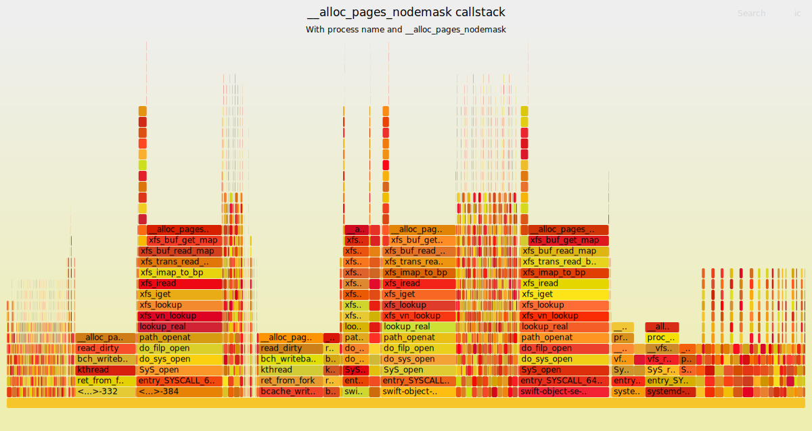
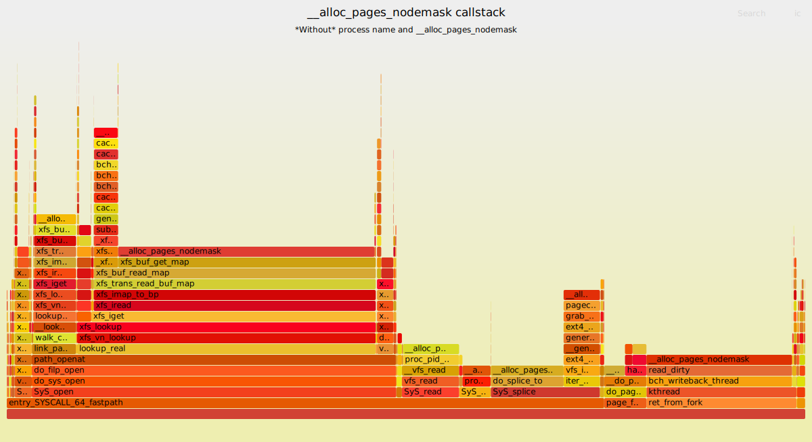

# Linux Performance and Data Analysis Utilities

This is a light-weight utility used for performance profiling and data analysis.

## Table of Contents

- [Performance data capturing](#performance-data-capturing)
  - [easy-flamegraph configuration](#easy-flamegraph-configuration)
- [Flamegraph generation](#flamegraph-generation)
  - [cpu](#cpu)
  - [memory](#memory)
  - [io](#io)
  - [gen-flamegraph.sh](#gen-flamegraphsh)

## Performance data capturing

The performance data capturing is currently based on Perf. By default, it will profile per-minute for one second period to capture the CPU/Memory/IO realated perf event data. Then, the log data will be translated to the files with specific formats(csv,tsv...) for further analysis(ScatterPlot/Flamegraph/LineChart...etc.).

After git clone the repo, the tool can be installed to the system by:

$ sudo make install

Then, the code will be put under:

\$ ls /usr/lib/easy-flamegraph/
conditions  entry  ezcli  FlameGraph  gen-flamegraph.sh  lib  perf-output  sysinfo

The periodic sampling is implemented in the crontab config:
```
\$ cat /etc/cron.d/easy-flamegraph-cron
\# Flamegraph-mem sample in 1 minute period
\*/1 * * * * root /usr/lib/easy-flamegraph/entry > /dev/null
```


### easy-flamegraph configuration
The configuration file is /etc/default/easy-flamegraph.conf.

There are global settings which can apply to each subsystems(cpu/mem/io...). And the name is started with G.

e.g.

```
\# Specify the sampling rate
G_SRATE=99

\# Specify PID for perf record
G_PID=

\# How many seconds perf record should run
G_PERF_PERIOD=1
```


## Flamegraph generation
The flamegraph will be generated automatically into the specific subsystem folders: /var/log/easy-flamegraph{cpu,mem,io}. However, the specific flamegraph generation needs to be enabled in the etc/default/easy-flamegraph.conf.


### CPU
USE_CPU=true

```
$ google-chrome-stable /var/log/easy-flamegraph/cpu/2020-08-10_151802.cpu.t25u26.svg
```

By default, In order to decrease the overhead, the CPU profiler is triggered when the whole system average CPU utilization >= 25%.

CPU_THRESHOLD=25

The svg naming rule: t25 means the current threshold is 25%. u26 means the captured CPU utilization is 26%(>=25%).

====================
The CPU flamegraph is generated by profiling the CPU by ```perf record -a --call-graph dwarf sleep 1```. And this can show the whole system CPU utlization in a specific moment.

`TODO`: The BCC profile to replace the Perf as it's light weight and can reduce the user<->kernel data transfer overhead.
```
sudo python3 /usr/share/bcc/tools/profile -a -I -F 1999 -f 1  | /usr/lib/easy-flamegraph/FlameGraph/flamegraph.pl   > /tmp/stack_for_flame.svg; google-chrome-stable /tmp/stack_for_flame.svg
```

### Memory
The memory flamegraph profiles the user/kernel space memory allocation related to function: page fault/mmap/malloc. This is useful in debugging the memory leak problem.

`TODO`: Ftrace can be used as the backend implementation to catpure the callstack of the page_alloc perf event. And this is more accurate compared to the perf event as Ftrace captures the dumpstack of page allocation continuously instead of sampling the CPU used by Perf. If you use the ```perf probe __alloc_pages_nodemask``` and then ```perf record -a -g``` to profile the callstack of the __alloc_pages_nodemask, there will not be much callstack as expected. As perf is the profiling basis tool and doesn't track every calling path.

The ftrace dump log: [alloc_pages_report.log](https://people.canonical.com/~gavinguo/276737/alloc_pages_report.log)

```
$ sudo trace-cmd record -a -e kmem:mm_page_alloc  -T sleep 1
$ sudo trace-cmd report > alloc_pages_report.log
```

Then, the log file can be parsed by [stackcollapse-tracecmd.pl](https://github.com/bboymimi/FlameGraph/blob/gavin/stackcollapse-tracecmd.pl)

```
cat ~/Downloads/276737/alloc_pages_report.log | ./stackcollapse-tracecmd.pl --process_name --trace_func_name=__alloc_pages_nodemask | ./flamegraph.pl --title "__alloc_pages_nodemask callstack" --subtitle "With process name and __alloc_pages_nodemask"  > with-pname-ftrace.svg
```



```
cat ~/Downloads/276737/alloc_pages_report.log | ./stackcollapse-tracecmd.pl  --trace_func_name "__alloc_pages_nodemask" | ./flamegraph.pl --title "__alloc_pages_nodemask callstack" --subtitle "*Without* process name and __alloc_pages_nodemask"  > no-pname-ftrace.svg
```




### IO
`TODO`: Need to implement the insert/completion of the BIOs. Also, the latency map can also be generated for each specific process.

### gen-flamegraph.sh
This is the wrapper used for the FlameGraph generation. The FlameGraph is invented by Brendan Greg. For more information, please refer to: https://github.com/brendangregg/FlameGraph

At first, you need to profile the system and get the perf.data:

```
# To get the all CPUs profiling callstack from user space to kernel space
$ sudo perf record -a --call-graph dwarf

# To get the all CPUs profiling of kernel space callstack
$ sudo perf record -a -g
```

By default, gen-flamegraph.sh will read the perf.data under the current folder or you can assign the perf.data by \"-i\":

It's preferred to add the \"sudo\" as reading the /proc/kallsyms need the root privilege if the kernel debug symbol isn't installed.

```
$ git clone https://github.com/bboymimi/perf-utils.git
$ sudo gen-flamegraph.sh -i perf.data
```

Or grep the specific string you are interested to generate the FlameGraph:

```
$ sudo ./gen-flamegraph.sh -g ssh
Use the /home/ubuntu/perf-utils/perf.data as the source of the FlameGraph.
###########
# The perf interactive .svg graph "/home/ubuntu/perf-output/2017-08-16_09:59:32.perf.data.foldedSssh.svg" has been generated.

# The FlameGraph can be viewed by:
# $ google-chrome-stable /home/ubuntu/perf-output/2017-08-16_09:59:32.perf.data.foldedSssh.svg
# or
# $ firefox /home/ubuntu/perf-output/2017-08-16_09:59:32.perf.data.foldedSssh.svg

```

Read the help page to get more detail:

```
$ ./gen-flamegraph.sh -h
usage: ./gen-flamegraph.sh -g <grep string to make specific flamegraph> -i <perf file> -k <kernel version #>
        d - drop the perf related data(include perf.data!!) and keep the .svg flamegraph file to save space
        g - grep strings - to grep specific strings e.g., kworker, to make flamegraph
        i - perf report file
        k - kernel version - specific kernel version number
        o - output directory - the output directory to save the .svg/script file
        s - symfs - to assign the directory to search for the debug symbol of kernel modules
        t - tar the /home/vin/os/easy-flamegraph/perf-output/
        p - generate the flamegraph for each CPU
        subtitle - the subtitle of the framegraph
        title - the title of the framegraph
```
